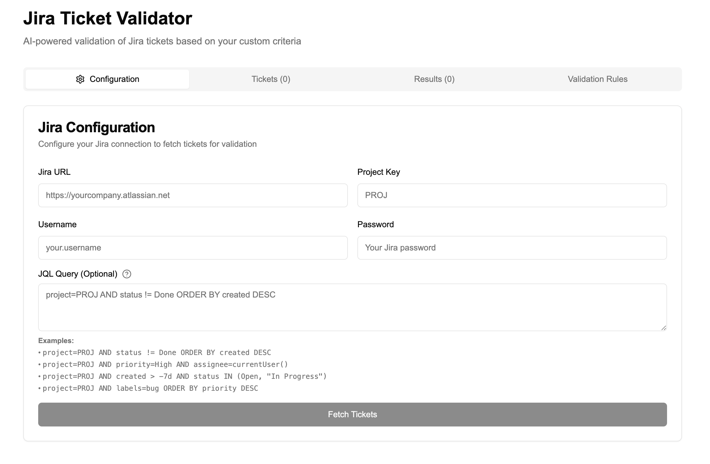
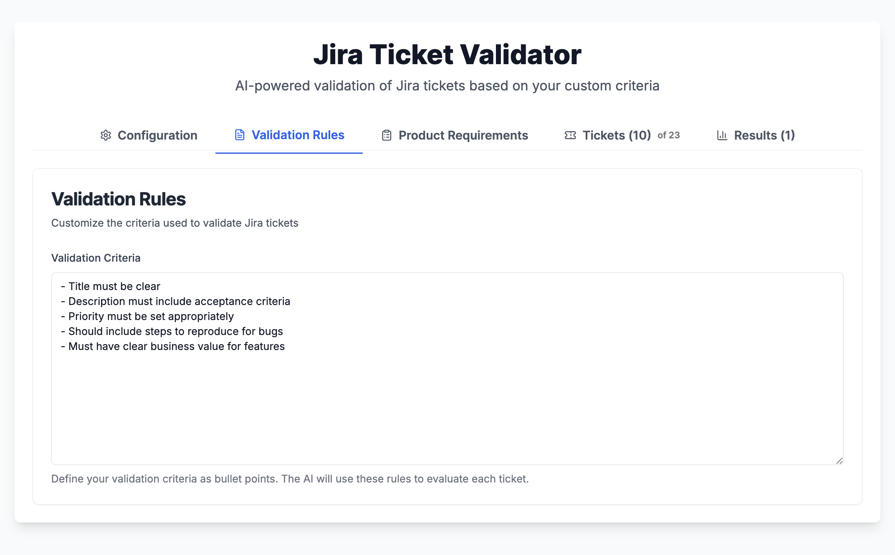
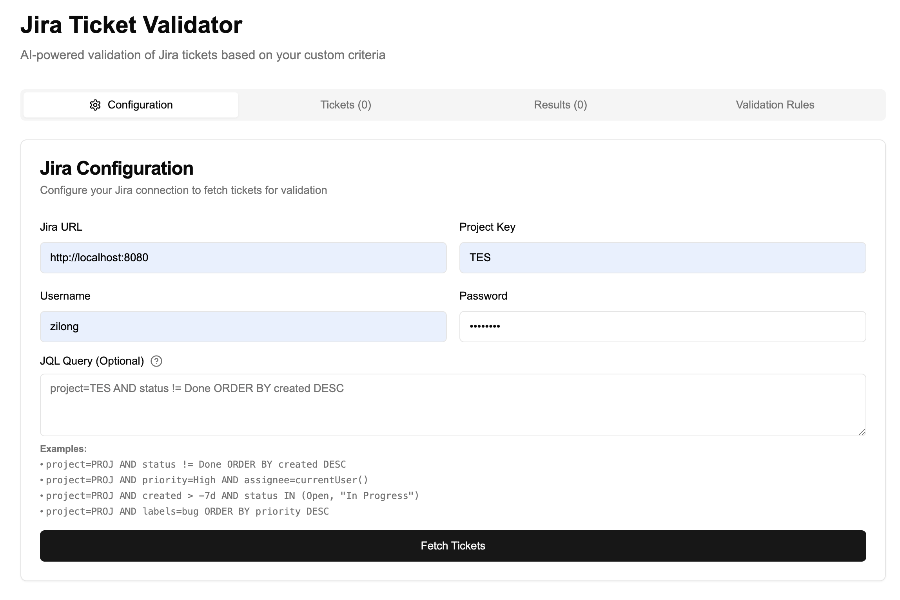
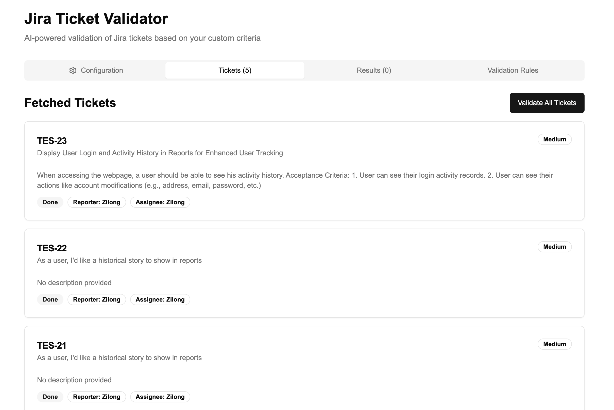
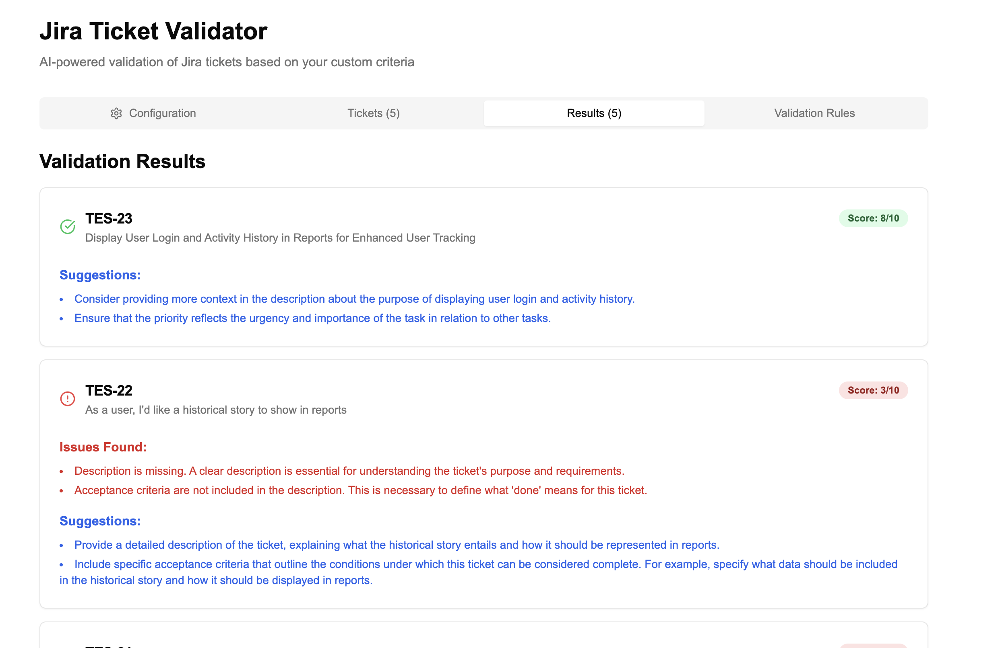

# 📘 AI Jira Ticket Validator

**AI Jira Ticket Validator** is a AI-powered, Jira Ticket Validator assistant that allows Jira users to review their tickets (ex: using custom text rules like ticket description should be added and priority set, etc.).

---

## 🧠 How It Works

This app uses a **OpenAI LLM with gpt-4o-mini model** to process each ticket against your validation rules:

1. **🗣 Natural Language Validation Rules (User)**  
   Users type their validation rules using the frontend.

2. **⚙ Add your Jira Configuration to retrieve your Jira tickets**  
   Input your Jira URL, Project Key, Username, and Password.

3. **🔍 Jira tickets Fetching and Validation**  
   Fetch your tickets and validate them against the defined Validation Rules.

4. **🤖️ Explore your Results**  
   Each ticket then receives a score (X/10) and the AI lists the issues found and gives some improvement suggestions.

5. **🔄 Update tickets and refresh**  
   Update your tickets accordingly and re-fetch/re-validate your tickets to see the improvements.

---

## ✅ Demo

1. Access [http://localhost:3000/](http://localhost:3000/) and add your Jira access "Configuration" (ex: Jira URL, Project Key, etc)
   


2. Customize your "Validation Rules"
   


3. Add your Product Requirements
   


4. Fetch Tickets
   


5. Validate your Tickets
   

---

## 🚀 Getting Started

```bash
git clone https://github.com/zilongqiu/ai_jira_ticket_validator.git
cd ai_jira_ticket_validator

cp example.env .env.local # Update the .env.local to add your OPEN_API API KEY (ex: OPENAI_API_KEY=sk-xxx)

npm install
npm run dev
```

---

## 🛠 Tech Stack

| Component         | Technology                                      |
|-------------------|-------------------------------------------------|
| Frontend UI       | NextJS                                          |
| LLMs              | OpenAI / gpt-4 (via API)                        |


---

## 📜  Liability Disclaimer

This **ai_jira_ticket_validator** is provided "as is" without any warranties or guarantees.
I do not take responsibility for how the generated output is used, including but not limited to its accuracy, legality, or any potential consequences arising from its use.

This project is licensed under the MIT License.