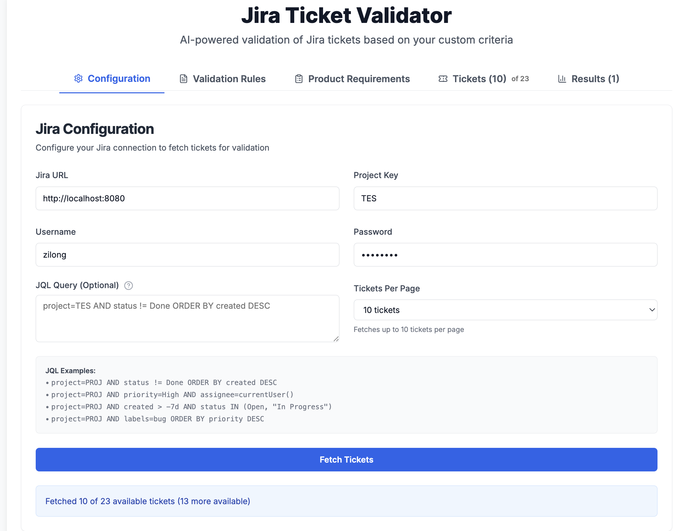
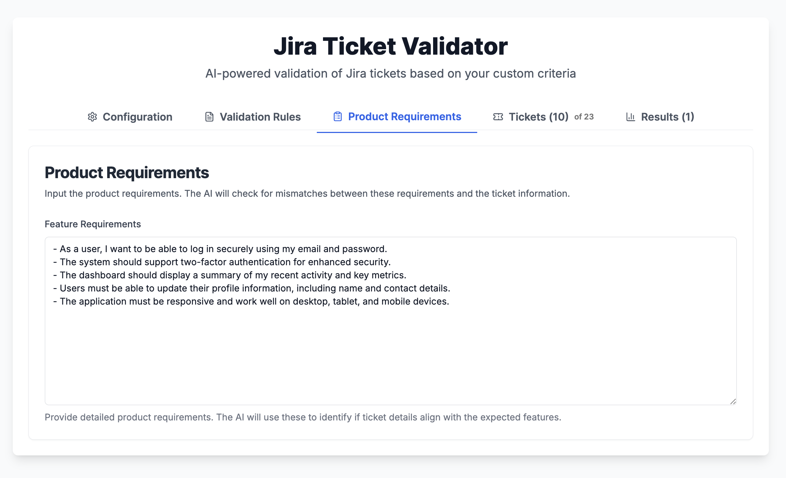
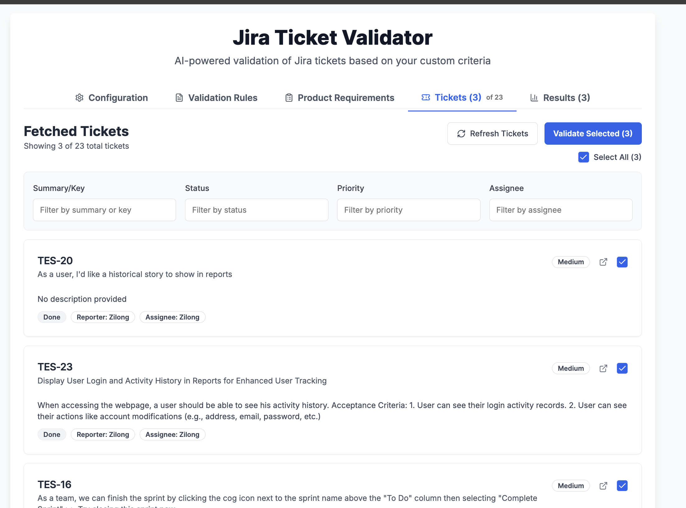
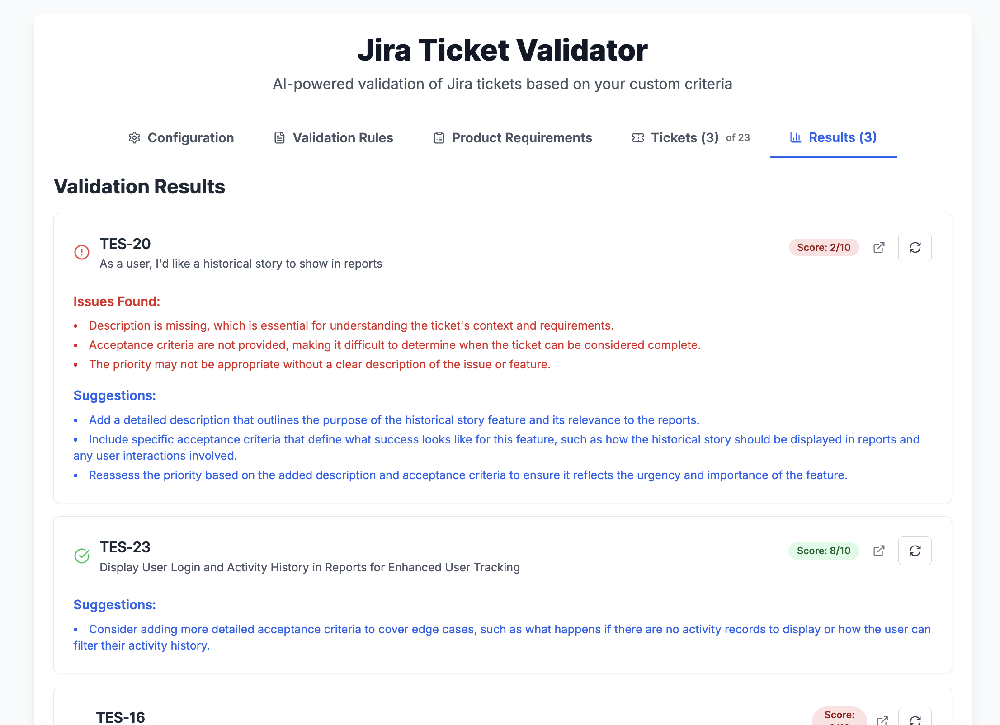

# 📘 AI Jira Ticket Validator

**AI Jira Ticket Validator** is a AI-powered, Jira Ticket Validator assistant that allows Jira users to review their tickets (ex: using custom text rules like ticket description should be added and priority set, etc.).

---

## 🧠 How It Works

This app uses a **OpenAI LLM with gpt-4o-mini model** to process each ticket against your validation rules:

1. **🗣 Natural Language Validation Rules (User)**  
   Users type their validation rules using the frontend.

2. **⚙ Add your Jira Configuration to retrieve your Jira tickets**  
   Input your Jira URL, Project Key, Username, and Password.

3. **🔍 Jira tickets Fetching and Validation**  
   Fetch your tickets and validate them against the defined Validation Rules.

4. **🤖️ Explore your Results**  
   Each ticket then receives a score (X/10) and the AI lists the issues found and gives some improvement suggestions.

5. **🔄 Update tickets and refresh**  
   Update your tickets accordingly and re-fetch/re-validate your tickets to see the improvements.

---

## ✅ Demo

1. Access [http://localhost:3000/](http://localhost:3000/)
   


2. Customize your "Validation Rules"
   


3. Add your Jira access "Configuration" (ex: Jira URL, Project Key, etc)
   


4. Click on "Fetch Tickets"
   


5. After seeing your tickets, click on "Validate All Tickets"
   

---

## 🚀 Getting Started

```bash
git clone https://github.com/zilongqiu/ai_jira_ticket_validator.git
cd ai_jira_ticket_validator

cp example.env .env.local # Update the .env.local to add your OPEN_API API KEY (ex: OPENAI_API_KEY=sk-xxx)

npm install
npm run dev
```

---

## 🛠 Tech Stack

| Component         | Technology                                      |
|-------------------|-------------------------------------------------|
| Frontend UI       | NextJS                                          |
| LLMs              | OpenAI / gpt-4o-mini (via API)                        |


